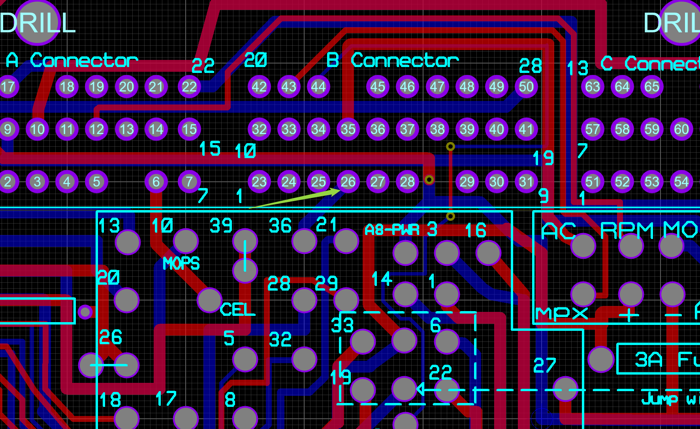
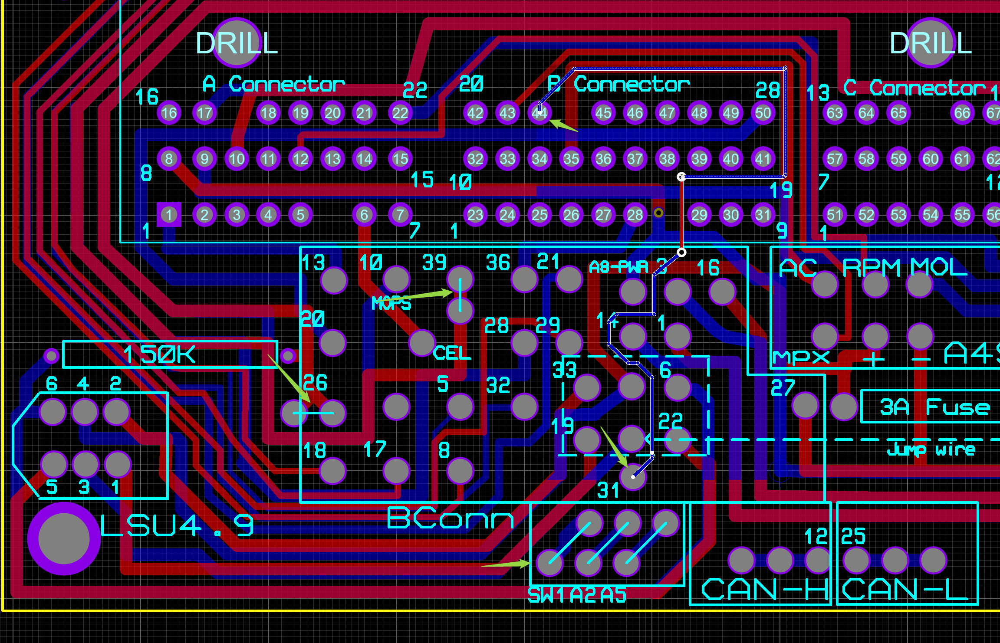
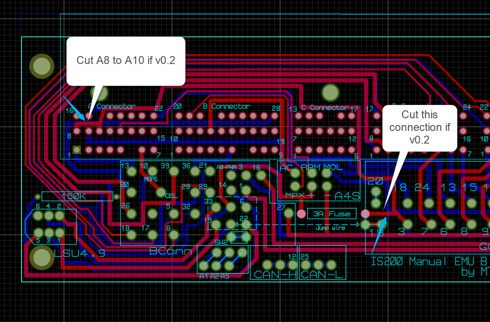
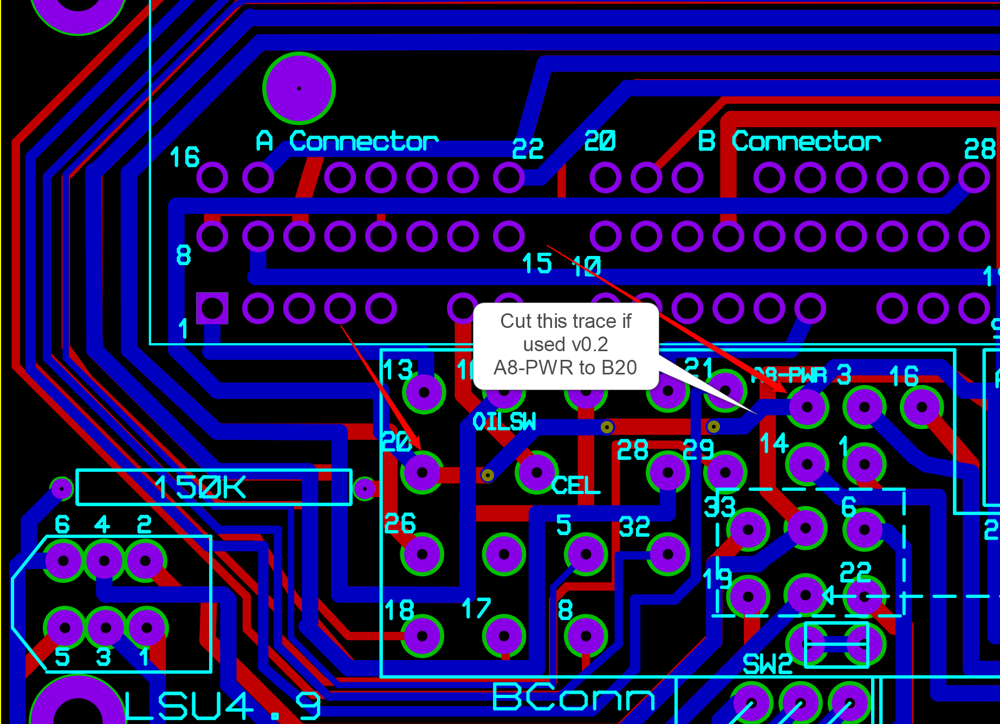

# Is200 to EMU Black Wire harness and basemap

This project was created as an alternative to expensive wiring harness sold on the web.
It was created entirely from scratch and it is for Lexus Is200 Manual (1999) model. 

It allows Ecumaster EMU Black ECU to be swapped into original OEM ECU without any wire modification. My original plan is to use the original OEM ecu box for all the components.

# Table of Contents
1. [Requirements](#Requirements)
3. [ECU Pinouts](#Pinouts)
4. [EMU Black Basemap](#Basemap)
5. [PCB Gerber files](#PCBs)
6. [TODO List](#TODO)
6. [Dyno Graph](#Dyno)
7. [Contacts](#Contacts)

# Change log 23.6.2022:
1. Added board version 0.5 with AC Pressure switch added to black connector

    

2. Added pictures of the assebled unit
3. Soldering and crimping the wires took me roughly a few hours. 
   The connections are not so great on the Black connector but i've got everyting connected. Maybe in the future i might do another PCB with better traces but at this moment it is pointless. Let me know if anything can be improved.

# Change log 10.6.2022:

1. Created Performance MAP.
2. Assigned Aux 1 as Boost solenoid Output
3. Fixes 
 - Gear ration
 - Fixed knock sensor Sense table and configured knock control
 - Knock Sensor values (stock knock sensors)
 - Fixed VVTI pid control
 - VVTI table
 - ACIS control
 - VE Table
 - lambda table
 - timing advance table
4. We found out that the car run rock solid at 0.9 bar of boost with 1zz injectors and stock fuel pump
5. Need different turbocharger because of backpressure
6. Added dyno graph 
7. Added new basemap file called performance map

# Change log 17.05.2022:

1. Connected Pin B22 to Black 31 (Analog 1) for Cruise Control
- Expanded a few pins so they can be easily soldered if needed

    

# Change log 12.05.2022: 
1. Do not use PCB version 0.2 (removed from repo).

- Due to error **A8-PWR** was connected to **Black Connector pin 20**.
- Wrong connection between A8 and A10 
- Wrong Connection between Grey pin 3 and FUSE
- **Cut the traces or use later versions**

    

    

- Connect A8-PWR to A8 (fixed in later versions).
- Connect A8 to E18 and E20
- Connect A8 to Fuse

2. Added more space between **A4S** pins

# Requirements
1. EMU Black ECU
2. Bosch Wideband Sensor LSU 4.9 
3. ECU Header [8-5353015-1](https://www.te.com/usa-en/product-8-5353015-1.html)
4. 39pin and 24pin Connectors

# Pinouts

EMU Black Pinout

  

Mapped PINS

  **A6 pin is used for CEL**

Bosch LSU 4.9 wiring

  

  

All4 Swap 

  

# Performance MAP

Use this MAP as basemap . Alot of fixes were made to the basemap as Knock Sensing, VVTi etc.

[Peformance MAP ver 0.2](./lib/IS200%20-%20Performance%20map%20-0.1.emub)

 1. Not fixed : 
 - Idle control 

# Basemap

This is the first revision of the BaseMap.

[BaseMAP](./lib/is200-manual-0.1.emub)

# PCBs
I had created two PCBs for this project. 
The first one was a PoC that expands all 122 pins from the original 1GFE ecu header to a PCB board.
It is very usefull if you have to do your own wiring and do not want to solder directly into the ECU Header.
The first version is compatible for Lexus IS200/IS300 ecu header and most of the Toyotas, Mazda Miata MX5, some Subarus and so on. I've tried to solder directly on the pins but at somepoint they started to brake. 

That's why i put alot of effort to do this design

## Version 0.1 

Current prototype :

  

Gerber Files : [1G/1J/2J/Miata Header Gerber Files](./PCB/JZ-header%20-%20CADCAM.ZIP)

## Version 0.5

During my install i encountered a problem with All4Swap device. 
It turns out that it doesn't work with my IS200 2000.5 version of the AC Unit. 
I decided to use the EMU Black control for the AC Unit until i find a better solution. Proposed resolution was to change the AC Unit with a previous version but it can't be done because the wiring is different.

That's why i'm adding a new bord version that is used to connect Pressure Swith to the board. If you already have a board that is v0.4 and want to use AC Pressure switch as input then just cut the trace to B6 and move it to B4

Removed Brake Swith (B6) and connected AC Pressure Switch to Black Connector 36

A few picture before all holes were drilled and the unit was installed into the "original" box.
Need to install the top cover with spacers.

Decided to install EMU Black CAN to Bluetooth module so i can connecto to the ECU with android app and check paramters. Keep in mind that the powersupply to the Bluetooth module is not expanded on the board so just splice 12v and GND to all4swap box power supply traces(wires).

I'm still working on the Cruise controll connection but the power pins were connected aswell so hopefully in a few days/months i will be able to do it.

  

  

Gerber Files: [IS200 Manual Gerber files](./PCB/JZ-header-v0.5%20-%20CADCAM.ZIP)

## Version 0.4

I had a few days to decide how to implement Cruise Control and i came up with an idea to use the stock Cruise Control switch on the IS200 steering wheel. Need to figure out how to connect Black 39 and Black 26 to steering column for the MUX Switch . 
The Emu Black MUX swith will allow to use 3 external Switches to single Analog input (Analog 1 in my case)
CC will need just 2 Switches (Set/Cancel and Resume Input switches) so one will left for something else.

The current OEM cruise control Switch has 3 posions and 1 Set/Cancel switch so a modification is needed.
At the moment i'm building the resistor matrix inside the OEM switch so i can use it for my purposes (3d printing and PCB etching to the rescue :) )

Updated the traces and added a new PCB version v0.4

 **B2 pin is used for Cruise Control on the OEM ECU**

 **Moved Switch 1 to bottom**

 **Expanded Black 26 for 5v**

 **Expanded Black 39 for GND**

Gerber Files: [IS200 Manual Gerber files](./PCB/JZ-header-v0.4%20-%20CADCAM.ZIP)

## Assembly

You will need: 

1. Bosch LSU 4.9 Wideband sensor
2. (Optional) All4Swap box for the A/C control unit and IS200 dashboard. 

    I'm adding this as optional because the RPMs/Check Engine Light may not be directly connected to the All4Swap box. A/C relay can be controlled directly from the EMU Black if needed (forget about the climate controll unit in your car or some precautions). I assume that All4Swap box is just sending On/Off signal based on climate controll temperature.

    Most Toyotas from these days are using BEANS network for communucation and does not relly on direct CAN communication. Thats why you need a MPX (multiplexor) device connected to the BEANS network to have control over the IS200 cluster or A/C. Fuel or coolant temperature gauge for example are controlled through the BEANS network from the Combination Meter (Body ECU) . Combination meter receives a signal from the OEM Ecu for different sensors - OIL pressure, OIL level, Fuel, coolant and all sorts of other sensors. 

    The problem with All4Swap box is that in this application it can be used to show or control only: 
    * A/C Unit 
    * Coolant (with additional Output from the EMU Black or other external NCT temperature sensor)
    * OIL Pressure

    If for example EMU Bluetooth device is used with EMU Black then most of the usefull sensors can be displayed on EMUDash and the All4Swap box can be used only to control the A/C Unit . That's why i'm adding this as optional, because i'm not planning to use it in the future.

3. 150k ohm resistor
4. 3A Fuse
5. Wires

**A6 pin is used for CEL and it is not connected to any EMU Pins.A6 is expanded**

  

**D1 pin is used for Oil Pressure and it is not connected to any EMU Pins.D1 is expanded**

  

 **E6 pin is used for Oil Level Switch and it is not connected to any EMU Pins.E6 is expanded**

  

Gerber Files: [IS200 Manual Gerber files](./PCB/IS200%20-%20CADCAM.ZIP)

# Additional Information

## Coil Dwell Time
Coil Dwell time found on the internet

  

## ECU Header
If you want to build your own PCB in proteus here is the Library.

ECU Header for Proteus 8: [ECUHeader](./lib/8-5353015-1.zip)

  

# TODO

- [x] Create PCBs
- [x] Do a basic MAP
- [x] Test all outputs and Inputs
- [x] Wire and test Wideband
- [x] Connect All4Swap device and test A/C
- [x] Setup Drive By Wire
- [x] Setup All Sensors (VVTI/EVAP/Crank/Cam..etc)
- [x] Perform Hot start tests 
- [x] Setup Injectors
- [x] Setup Knock Sensors
- [x] Setup Dwell time on coils
- [x] Need to set Trigger Angle (car missing at the moment)
- [x] Dyno Test
- [x] Set AFR Table 
- [x] Set VVTI Table
- [x] VE Tables 
- [ ] IDLE Control (work in progress)
- [ ] Add TRC Input from the ABS sensors and configure the Traction Control in the EMU Black (need aditional logic).I might end using builtin TRC Control.
- [x] Move boost solenoid into the EMU Black 
- [ ] CLT not shown on Dash (don't think i needed)
- [ ] Oil Pressure light missing on dash (maybe i will use EMU Dash with bluetooth.Otherwise ...All4Swap)
- [ ] Check Engine Light not connected. (maybe i will use the EMU Dash for this)
- [ ] Add Blutooth device (waiting for car headunit)
- [ ] 3D Printed parts to attach the PCB into the original OEM ECU Box. Nedd final PCB

# Nice to have things

- [ ] Create my own MPX Implementation
- [ ] Table Switches 
- [ ] Clutch switch for Launch control 

You can start the car with this configuration.At this moment a fine tune is needed. Stay...tuned :) 

# Dyno 

### 10.6.2022 

- **208** Wheel HP at 5300 RPM/ **310NM**

Boost **drop** due to small turbocharger and alot of backpressure

  

# Contacts
mtrx at outlook dot com