# Is200 to EMU Black Wire harness and basemap

This project was created as an alternative to expensive wiring harness sold on the web.
It was created entirely from scratch and it is for Lexus Is200 Manual (1999) model. 

It allows Ecumaster EMU Black ECU to be swapped into original OEM ECU without any wire modification. My original plan is to use the original OEM ecu box for all the components.

# Table of Contents
1. [Requirements](#Requirements)
3. [ECU Pinouts](#Pinouts)
4. [EMU Black Basemap](#Basemap)
5. [PCB Gerber files](#PCBs)
6. [TODO List](#TODO)
6. [Contacts](#Contacts)

# Requirements
1. EMU Black ECU
2. Bosch Wideband Sensor LSU 4.9 
3. ECU Header [8-5353015-1](https://www.te.com/usa-en/product-8-5353015-1.html)
4. 39pin and 24pin Connectors

# Pinouts

EMU Black Pinout

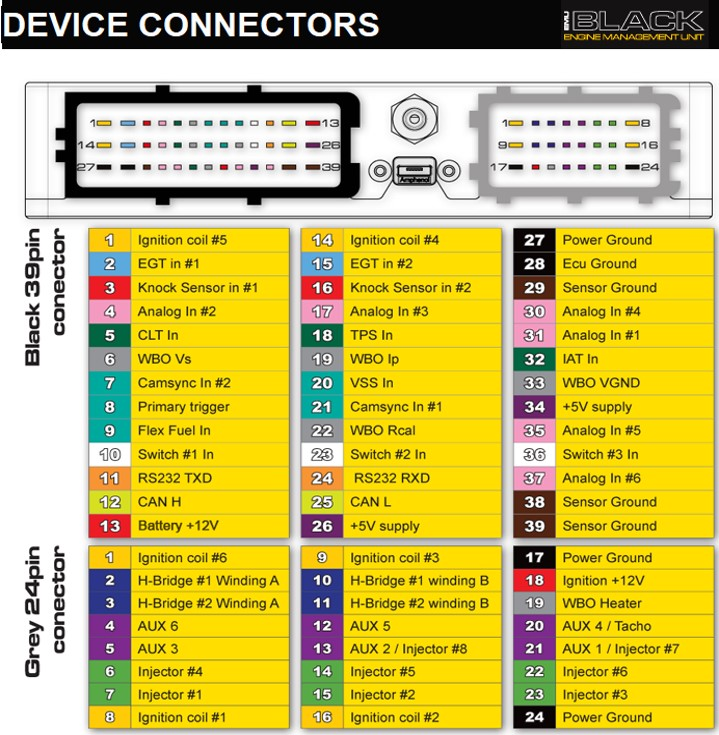

Mapped PINS

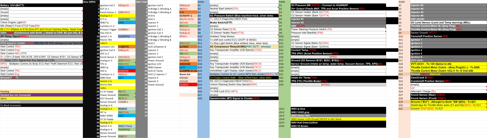
  **A6 pin is used for CEL**

Bosch LSU 4.9 wiring

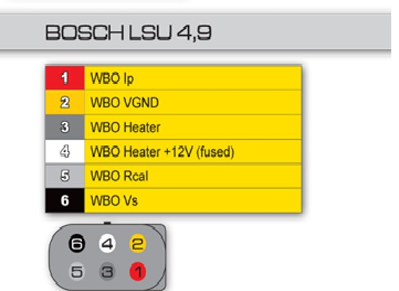

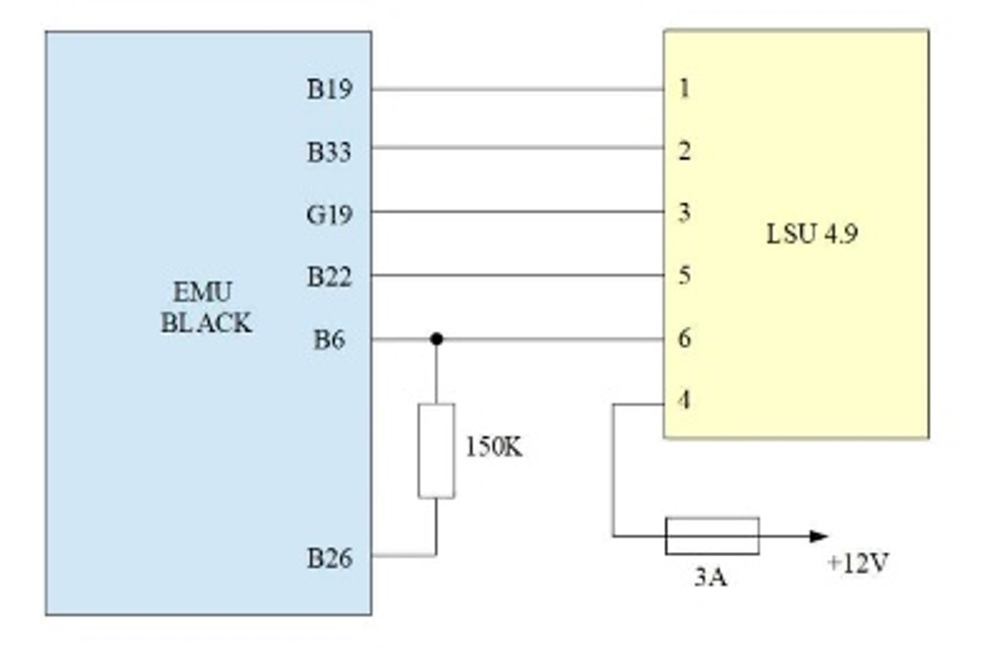

All4 Swap 

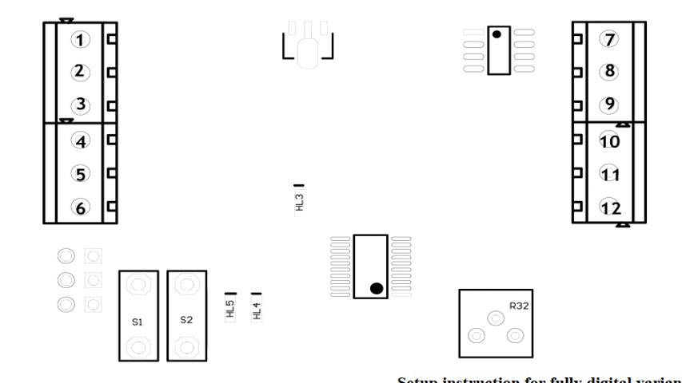

# Basemap

This is the first revision of the BaseMap.

[BaseMAP](./lib/is200-manual-0.1.emub)

# PCBs
I had created two PCBs for this project. 
The first one was a PoC that expands all 122 pins fro the original 1GFE ecu heade to a PCB Borad.
It is very usefull if you have to do your own wiring and do not want to solder directly into the ECU Header.
The first version is compatible for Lexus IS200/IS300 ecu header and most of the Toyotas, Mazda Miata MX5, Some Subarus and so on. I've tried to solder directly on the pins but at somepoint they started to brake. 

That's why i put alot of effort to do this design

## Version 0.1 

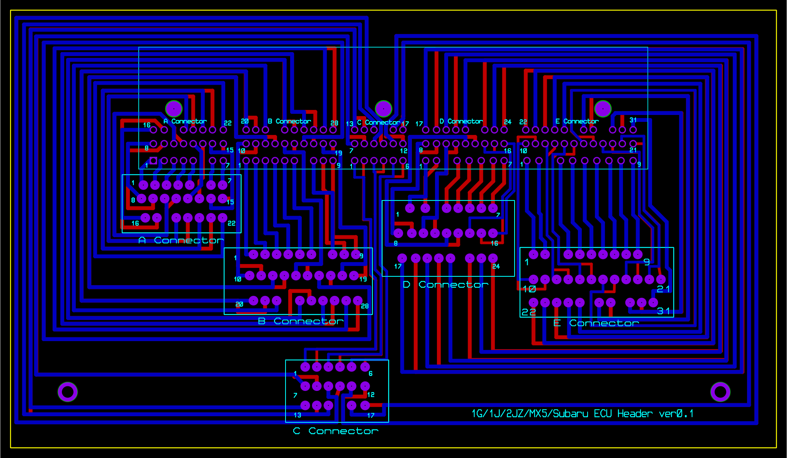

Current prototype :

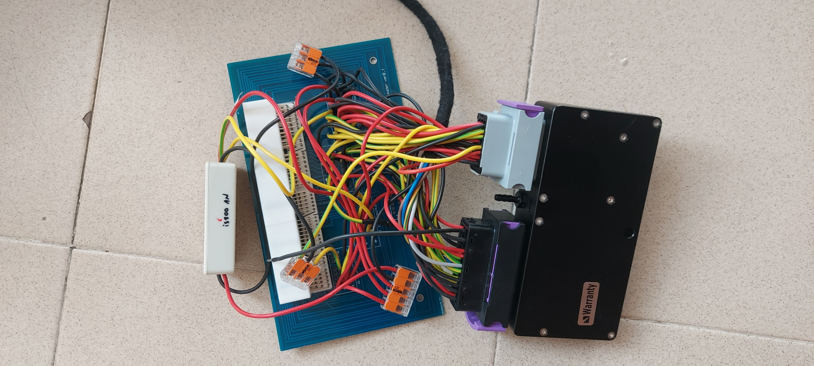

Gerber Files : [1G/1J/2J/Miata Header Gerber Files](./PCB/JZ-header%20-%20CADCAM.ZIP)

## Version 0.2
The later version was optimized so that is smaller and can fit in the original OEM ECU box with EMU Black inside.

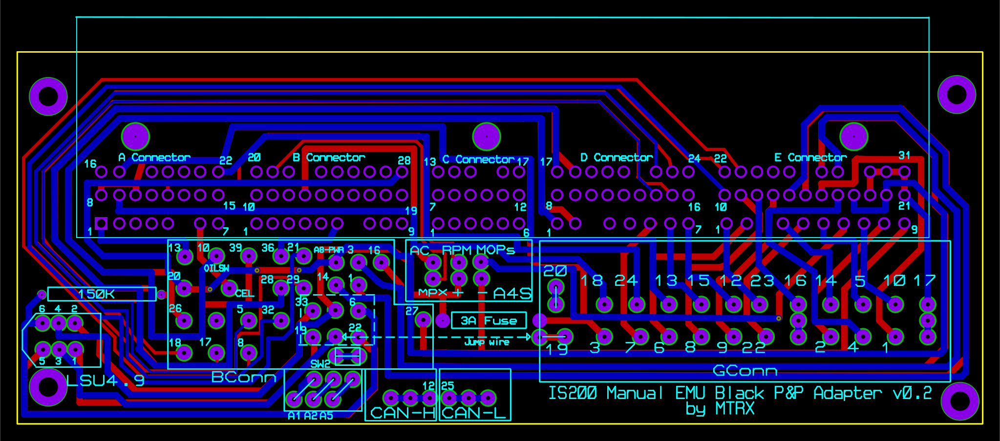

You will need: 

1. Bosch LSU 4.9 Wideband sensor
2. (Optional) All4Swap box for the A/C control unit and IS200 dashboard. 

    I'm adding this as optional because the RPMs/Check Engine Light may not be directly connected to the All4Swap box. A/C relay can be controlled directly from the EMU Black if needed (forget about the climate controll unit in your car or some precautions). I assume that All4Swap box is just sending On/Off signal based on climate controll temperature.

    Most Toyotas from these days are using BEANS network for communucation and does not relly on direct CAN communication. Thats why you need a MPX (multiplexor) device connected to the BEANS network to have control over the IS200 cluster or A/C. Fuel or coolant temperature gauge for example are controlled through the BEANS network from the Combination Meter (Body ECU) . Combination meter receives a signal from the OEM Ecu for different sensors - OIL pressure, OIL level, Fuel, coolant and all sorts of other sensors. 

    The problem with All4Swap box is that in this application it can be used to show or control only: 
    * A/C Unit 
    * Coolant (with additional Output from the EMU Black or other external NCT temperature sensor)
    * OIL Pressure

    If for example EMU Bluetooth device is used with EMU Black then most of the usefull sensors can be displayed on EMUDash and the All4Swap box can be used only to control the A/C Unit . That's why i'm adding this as optional, because i'm not planning to use it in the future.

3. 150k ohm resistor
4. 3A Fuse
5. Wires

  **A6 pin is used for CEL and it is not connected to any EMU Pins.A6 is expanded**

  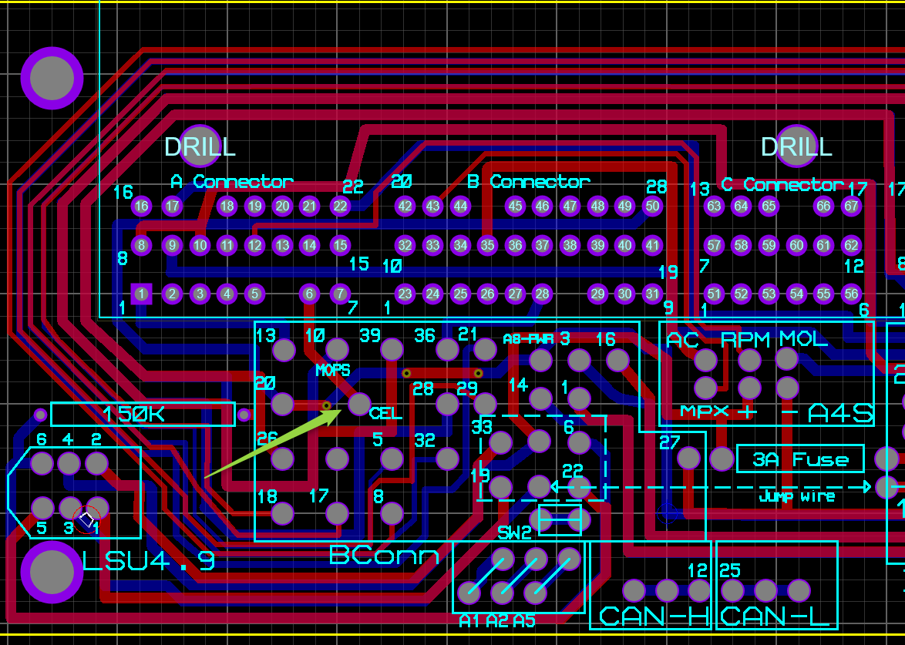

    **D1 pin is used for Oil Pressure and it is not connected to any EMU Pins.D1 is expanded**

  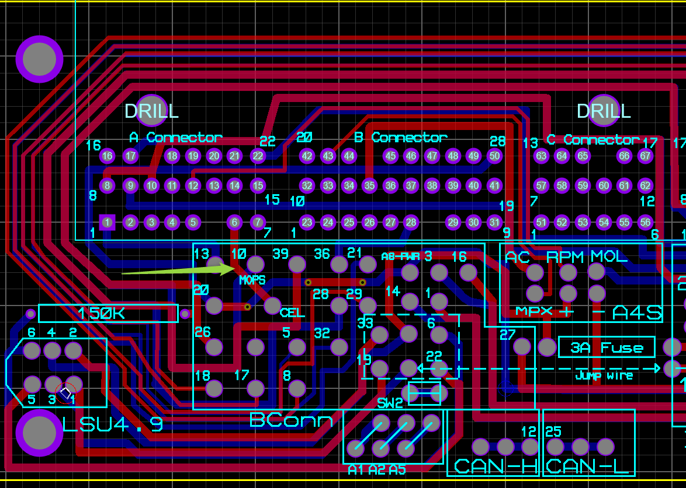

      **E6 pin is used for Oil Level Switch and it is not connected to any EMU Pins.E6 is expanded**

  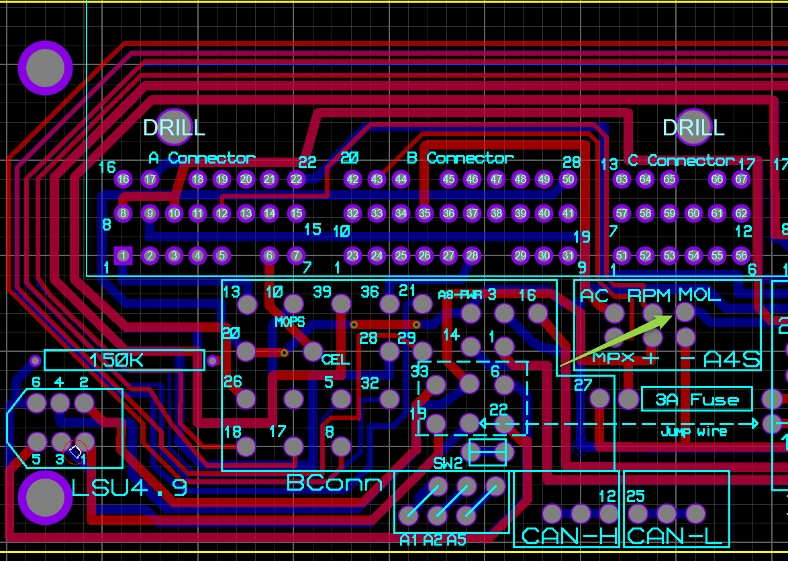

Gerber Files: [IS200 Manual Gerber files](./PCB/IS200%20-%20CADCAM.ZIP)

# Additional Information

## Coil Dwell Time
Coil Dwell time found on the internet

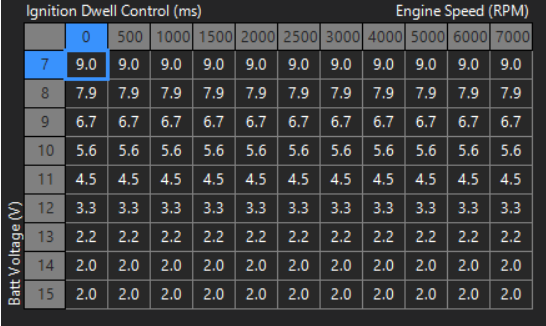

## ECU Header
If you want to build your own PCB in proteus here is the Library.

ECU Header for Proteus 8: [ECUHeader](./lib/8-5353015-1.zip)

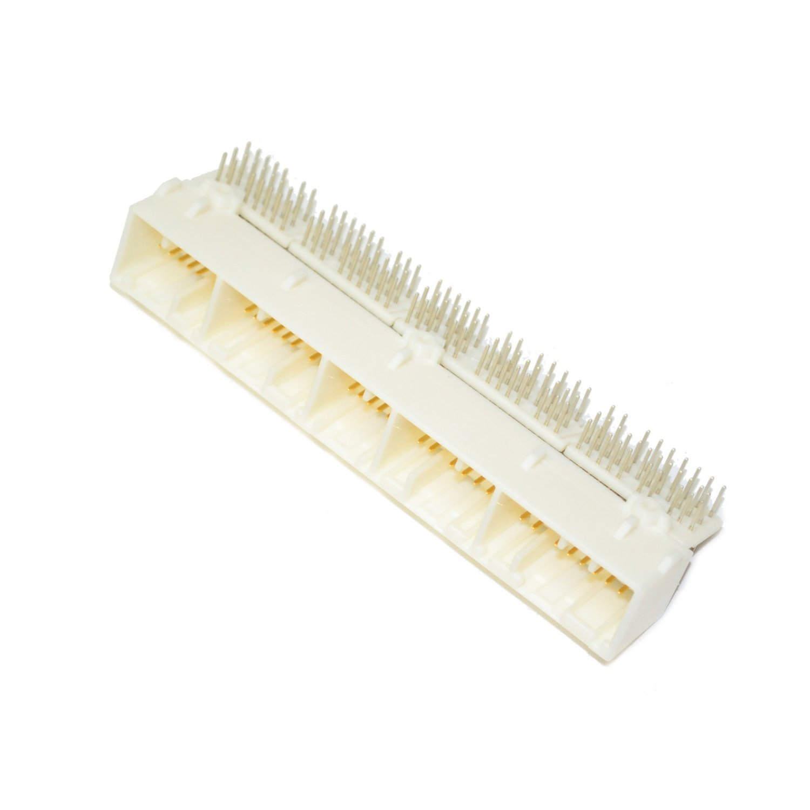

# TODO

- [x] Create PCBs
- [x] Do a basic MAP
- [x] Test all outputs and Inputs
- [x] Wire and test Wideband
- [x] Connect All4Swap device and test A/C
- [x] Setup Drive By Wire
- [x] Setup All Sensors (VVTI/EVAP/Crank/Cam..etc)
- [x] Perform Hot start tests 
- [x] Setup Injectors
- [x] Setup Knock Sensors
- [x] Setup Dwell time on coils
- [ ] Need to set Trigger Angle (car missing at the moment)
- [ ] Dyno Test
- [ ] Set AFR Table (need time)
- [ ] Set VVTI Table (need dyno)
- [ ] VE Tables (need dyno)
- [ ] IDLE Control (need time)
- [ ] Add TRC Input from the ABS sensors and configure the Traction Control in the EMU Black (need aditional logic).I might end using builtin TRC Control.
- [ ] Move boost solenoid into the EMU Black (this will be my last step)
- [ ] CLT not shown on Dash (don't think i needed)
- [ ] Oil Pressure light missing on dash (maybe i will use EMU Dash with bluetooth.Otherwise ...All4Swap)
- [ ] Check Engine Light not connected. (maybe i will use the EMU Dash for this)
- [ ] Add Blutooth device (waiting for car headunit)
- [ ] 3D Printed parts to attach the PCB into the original OEM ECU Box. Nedd final PCB

# Nice to have things

- [ ] Create my own MPX Implementation
- [ ] Table Switches 
- [ ] Clutch switch for Launch control 

You can start the car with this configuration.At this moment a fine tune is needed. Stay...tuned :) 

# Contacts
mtrx at outlook dot com