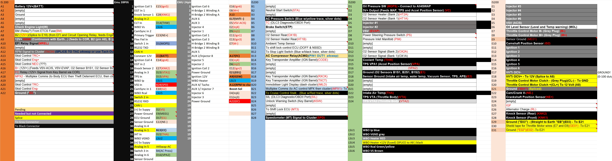

# Is200 to EMU Black Wire harness and basemap

This project was created as an alternative to expensive wiring harness sold on the web.
It was created entirely from scratch and it is for Lexus Is200 Manual (1999) model. 

It allows Ecumaster EMU Black ECU to be swapped into original OEM ECU without any wire modification. My original plan is to use the original OEM ecu box for all the components.

In this REPO you will find:

# Table of Contents
1. [What is workin](#Requirements)
3. [ECU Pinouts](#Pinouts)
4. [EMU Black Basemap](#Basemap)
5. [PCB Gerber files](#PCBs)
6. [TODO List](#TODO)

## Requirements
1. EMU Black ECU
2. Bosch Wideband Sensor LSU 4.9 
3. ECU Header [8-5353015-1](https://www.te.com/usa-en/product-8-5353015-1.html)
4. 39pin and 24pin Connectors

## Pinouts

EMU Black Pinout

Mapped PINS

Bosch LSU 4.9 wiring

All4 Swap 

# Basemap

This is the first revision of the BaseMap.

[BaseMAP](./lib/is200-manual-0.1.emub)

# PCBs
I had created two PCBs for this project. 
The first one was a PoC and actually expands all of the 122 1GFE connectors pins to a PCB. It is very usefull if you have to do your own wiring and do not want to solder directly into the ECU Header.
The first version is compatible for Lexus IS200/IS300 ecu header and most of the Toyotas, Mazda Miata MX5, Some Subarus and so on.

### Version 0.1 

Gerber Files : 

[1G/1J/2J/Miata Header Gerber Files](./PCB/JZ-header%20-%20CADCAM.ZIP)

### Version 0.2
The later version was optimized so that is smaller and can fit in the original OEM ECU box with EMU Black inside

You will need: 

1. Bosch LSU 4.9 Wideband sensor
2. (Optional) All4Swap box for the A/C control and is200 cluster communication.

    I'm adding this as optional because the RPMs/Check Engine Light may not be directly connected to the All4Swap box (search for it). A/C relay can be controlled directly from the EMU Black if needed (forget about the climate controll unit in your car)
    Most Toyotas from these days are using BEANS network for communucation and does not relly on direct CAN communication. Thats why you need a MPX (multiplexor) device connected to the BEANS network to have control over the IS200 cluster. Fuel or coolant temperature gauge for example are controlled through the BEANS network from the Combination Meter (Body ECU) . Combination meter receives a signal from the OEM Ecu for different sensors - OIL pressure, OIL level, Fuel, coolant and all sorts of sensors. 

    The problem with All4Swap box is that in this application it can be used to show only: 
    A/C Unit 
    Coolant (with additional Output from the EMU Black)
    OIL Pressure

    If for example EMU Bluetooth device is used with EMU Black then most of the usefull sensors can be displayed on EMUDash and the All4Swap box can be used only to control the A/C Unit . That's why i'm adding this as optional. 
3. 150k ohm resistor
4. 3A Fuse
5. Wires

Gerber Files: 

[IS200 Manual Gerber files](./PCB/IS200%20-%20CADCAM.ZIP)

## TODO list

- [ ] Add TRC Input from the ABS sensors of configure the Traction Control in the EMU Black
- [ ] VE Tables
- [ ] IDLE Control 
- [ ] Move boost solenoid into the EMU Black 
- [ ] 3D Printed parts to attach the PCB into the original OEM ECU Box
- [ ] Full Road test
- [x] 2nd version of the PCB

You can start the car with this configuration but at this moment a fine tune is needed. Stay...tuned :) 

